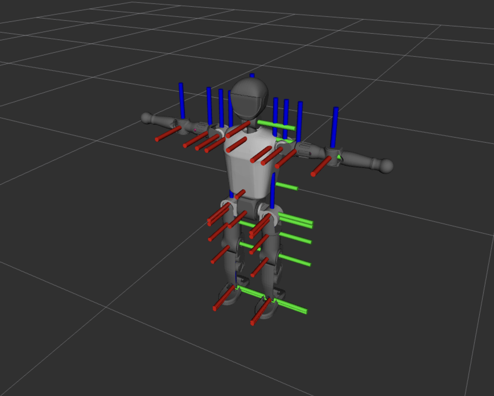

# Booster Robot Driver



ROS2 driver for the Booster T1 robot using ros2_control framework with native ROS2 topic communication (does not need Booster SDK).

## Overview

This package provides a hardware interface for the Booster T1 robot, enabling control through ROS2 using the ros2_control framework. It uses direct ROS2 topic communication via `booster_interface` messages. The driver supports both mock hardware mode for testing and real robot mode with safety features.

## Features

- **Native ROS2 Topic Communication**: Direct pub/sub via `/joint_ctrl` and `/low_state` topics
- **Zero External Dependencies**: Only requires `booster_interface` messages (no SDK needed, use our fork for easy ROS2 compilation)
- **Software Joint Limits**: Hardware protection with automatic clamping and warnings
- **Mock Hardware Support**: Full testing capabilities without real robot
- **Position control via JointGroupPositionController**
- **Constrained control via ConstrainedPositionController** with Ruckig motion planning
- **Official T1 URDF** with accurate meshes and joint definitions from Booster Robotics
- **RViz visualization** with proper fixed frame configuration

## Prerequisites

- tested on ROS2 Humble
- ros2_control packages
- aatb_controllers package (for constrained control)
- booster_interface package (ROS2 message definitions)

## Installation

```bash
# Clone these repositories in your workspace
git clone https://github.com/aatb-ch/booster_robot_driver.git
git clone https://github.com/aatb-ch/booster_interface.git
git clone https://github.com/aatb-ch/aatb_controllers.git

# Install dependencies
rosdep install --from-paths src --ignore-src -r -y

# Build packages
colcon build
```

## Usage

### Quick Start

```bash
# Source your ROS2 workspace
source ~/{your_ws}/install/setup.bash

# Launch the driver (default: mock hardware mode)
ros2 launch booster_robot_driver booster_t1_control.launch.py
```

Robot still needs to be switched to Custom mode via the remote control! otherwise it's only possible to read robot state but it wont accept commands.

### Mock Hardware Mode (Testing)

```bash
# Mock hardware (default) - allows immediate commanding
ros2 launch booster_robot_driver booster_t1_control.launch.py

# Constrained control with mock hardware (using Ruckig)
ros2 launch booster_robot_driver booster_t1_constrained_control.launch.py
```

### Real Robot Mode

Connects to real robot via ROS2 topics:

```bash
# Real robot mode - waits for /low_state before commanding
ros2 launch booster_robot_driver booster_t1_control.launch.py \
    use_mock_hardware:=false

# Constrained control with real robot (using Ruckig)
ros2 launch booster_robot_driver booster_t1_constrained_control.launch.py \
    use_mock_hardware:=false
```

**Note**: Real robot mode will wait during configuration (up to 10 seconds) for the first `LowState` message from `/low_state` topic to ensure safe initialization with actual robot positions.

## Launch Parameters

- `use_mock_hardware`: Use mock hardware for testing (default: true)
- `robot_description_file`: URDF/XACRO file name (default: T1_ros2_control.urdf.xacro)
- `launch_rviz`: Launch RViz for visualization (default: true)

## Topics

### Robot Communication Topics

- `/joint_ctrl` (booster_interface/msg/LowCmd): **Hardware publishes** joint commands to robot
- `/low_state` (booster_interface/msg/LowState): **Hardware subscribes** to robot state

### ROS2 Control Topics

- `/joint_states` (sensor_msgs/JointState): Current joint states (published by joint_state_broadcaster)
- `/dynamic_joint_states` (control_msgs/DynamicJointState): Extended joint state information

### Controller Command Topics

- `/joint_group_position_controller/commands` (std_msgs/Float64MultiArray): Position commands for basic control
- `/constrained_position_controller/commands` (std_msgs/Float64MultiArray): Position commands for constrained control using Ruckig

## Controllers

### Joint State Broadcaster
Publishes joint states to `/joint_states` topic.

### Joint Group Position Controller
Basic position control for all joints.

### Constrained Position Controller
Position control with velocity, acceleration, and jerk constraints using Ruckig trajectory generation for smooth motion planning.

## Configuration

Configuration files are located in the `config/` directory:

- `T1_joint_limits.yaml`: Joint position, velocity, and effort limits for all 23 joints
- `ros2_controllers.yaml`: Controller configuration for standard position control (23 joints)
- `constrained_controllers.yaml`: Controller configuration for constrained control using Ruckig (23 joints)

## Architecture

### Communication Flow

```
ROS2 Controller → Hardware Interface → /joint_ctrl → Robot
Robot → /low_state → Hardware Interface → ROS2 Controller
```

## License

This package is licensed under the MIT License. See [LICENSE](LICENSE) for details.

The T1 robot URDF and mesh files are derived from Booster Robotics' booster_gym project and are subject to the Apache License 2.0.

## Copyright

Copyright (c) 2025 Thibault Brevet / AATB GmbH
